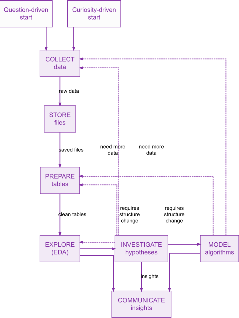
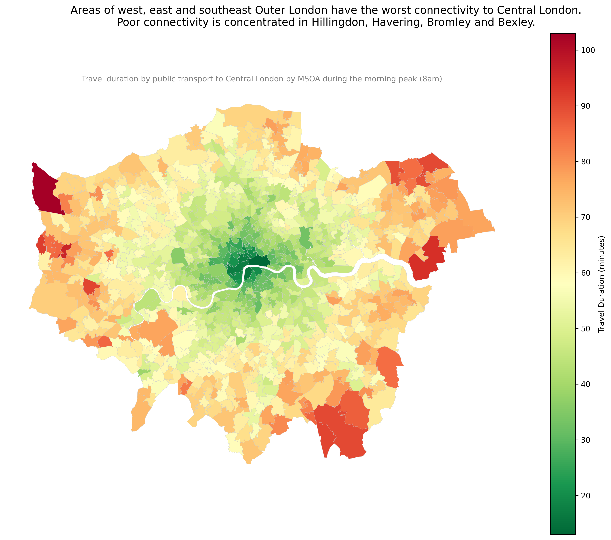
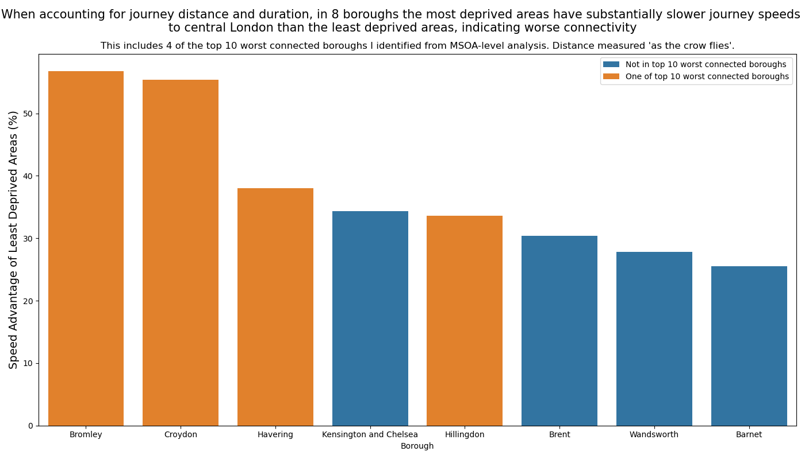

# DS105A (2025/2026) - ✍️ Mini Project 2

**Date:** 03/12/2025
**Author:** [Ahmad Abdulaziz](https://github.com/ahmad-cz)

This project is part of the [LSE DS105A Autumn Term 2025/2026](https://lse-dsi.github.io/DS105/2025-2026/autumn-term/course-info.qmd) course and aims to answer the question: **"Where are the areas in London with poor transport connectivity?"** with data from the [TfL Journey Planner API](https://api.tfl.gov.uk) and the [ONS Postcode Directory](https://data.london.gov.uk/dataset/postcode-directory-for-london-exp5p/).

## 📌 DECISIONS, DECISIONS, DECISIONS

To answer the question, I made the following choices:

### 1. **Reference point(s)**:

As I was analysing the connectivities from each MSOA **to** central London during the morning peak, to simulate a "morning commute", I wanted my location to somewhere in the economic centre of London and a central destination that could act as a location many commuters commute to. This then led me to research London's economic centre, and led me to find the Greater London Authority's (GLA) [Central Activities Zone](https://www.london.gov.uk/programmes-strategies/planning/implementing-london-plan/london-plan-guidance-and-spgs/central-activities-zone). This is described as "London's vibrant centre" and is given a special distinction and definition by the GLA. In [a document](https://www.london.gov.uk/sites/default/files/caz_spg_final_v4.pdf) about the Central Activities Zone, I saw a map of the zone and saw that the majority of the area is the City of London and London's West End (along with parts of the Southbank), so I wanted to find a location that was centrally located within the Central Activities Zone, while also not being too close to a train station or tube station to avoid "skewing" my travel duration data to locations along a specific Tube line. After a lot of consideration, I ended up **deciding that the London School of Economics and Political Science (LSE)** was the ideal location. This is because it sits right on the boundary between the West End and City of London, while also being close to the Southbank, and isn't located right "on" a Tube or national rail station that could bias the travel times.

Other locations I considered but didn't end up using were:
- Holborn: again centrally located like LSE, but it's located directly where a tube station is, so likely to bias travel times in favour of areas that are along the Central and Piccadilly lines.
- Tottenham Court Road (specifically the Centre Point Tower): located at the heart of London's West End, I didn't end up using it for similar reasons to Holborn (located on a tube station), but also because I deemed it too far from the City of London, which is the other part of the Central Activities Zone.
- Charing Cross: I used this as my point for London in mini-project 1, and this is the [official centre of London](https://www.bbc.co.uk/london/content/articles/2005/08/15/charingcross_feature.shtml). However, Charing Cross is located right next to a train station with services predominantly to Southeast and South London, so again I didn't choose Charing Cross due to fears about it biasing the data.

### 2. **Locations**:

For my locations, I had 2 main stages of data collection, each with slightly different locations. For my first round of data collection, I used **every MSOA in London** (with a sample postcode from each for a total of 983 postcodes) to create my choropleth map and to analyse borough-level patterns and variance in travel durations. As I explain in more detail in my reflections for NB01, I chose MSOAs as they were the most granular but also practical hierarchy of geography I could use to pass to the Journey Planner API. The London postcode directory contained over 300,000 postcodes, which wouldn't be realistic to pass to the API, and even with LSOAs (which I would have ideally used), there are around 5000 of them in London, which again is impractical to pass to the API unfortunately. Therefore, I used the 983 MSOAs in London, taking 1 postcode sample from each. Each MSOA has around [5000 to 15000 residents](https://www.ons.gov.uk/methodology/geography/ukgeographies/censusgeographies/census2021geographies) according to the ONS's website, so this is still quite granular data for the travel times in London.

After finding that many boroughs have quite varied travel times for their MSOAs to London, I decided to collect data on the **most deprived and least deprived area in each borough** to see whether the most deprived area in each borough has worse connectivity than the least deprived area in the same borough. The London Postcode Directory we used lists the Index of Multiple Deprivation (IMD) for each postcode, although the IMD is a measure used for the LSOA not postcode. Therefore, from each borough, I simply took 1 postcode that had the highest IMD score (least deprived), and 1 postcode that had the lowest IMD score (meaning most deprived).

### 3. **Time period**:

The time period I used was **08:00am on the 1st of December 2025**. This is to simulate the morning peak rush hour of commuters commuting **into** London, and is based on one of the time periods TfL use for their [own Travel Time mapping](https://content.tfl.gov.uk/connectivity-assessment-guide.pdf) used to assess connectivity. I chose the 1st of December 2025 as it was a Monday (therefore a weekday when people go to work) and (at the time of data collection) there weren't any planned engineering works on the TfL network listed on their website, so this ensured it was a representative comparison of connectivity.

### 4. **Other**: 

All modes of transporation are considered. The main data collected is the journey time, based on the first journey the Journey Planner API provides for each postcode. This is because, I [found](https://www.london.gov.uk/who-we-are/what-london-assembly-does/questions-mayor/find-an-answer/tfl-journey-planner-3) in my [research](https://www.london.gov.uk/who-we-are/what-london-assembly-does/questions-mayor/find-an-answer/step-free-journey-planner) that the TfL Journey Planner already gives the quickest journey by public transport at any given time, which is what I want to analyse. I go into more detail about this in my reflections in NB01. For the deprivation analysis, I also collect the total walking duration for each postcode's journey, although I didn't end up using this in the final visualisations seen in this report. In NB02 and NB03, the average speeds of journeys is also used, based on the "as the crow flies" distance between each deprived and not deprived postcode and LSE to provide extra depth to the analysis of travel times by factoring in the distance travelled too.

### 5. **Why I made these choices and how they help answer the question**:

I made these choices because, before I started mini-project 2, I researched quite a lot to see what TfL themselves use to assess transport connectivity, which allowed me to find [this document](https://content.tfl.gov.uk/connectivity-assessment-guide.pdf). This document sets out 3 main ways TfL assesses connectivity: the Public Transport Access Level (PTAL), Travel Time mapping, and Catchment analysis. Of these 3, I saw that travel time mapping was the most feasible measure that I could reconstruct based on the TfL Journey Planner API, which is why I chose it. The travel time map creates a map of the travel time to/from a set location, which is what I have based my choropleth map of travel times on and why I used "duration" as my main measure of connectivity. The PTAL, which is arguably a more hollistic view of transport connectivity, uses data such as the frequency of connections which isn't available on TfL's Journey Planner API, which is why I didn't use it. PTALs are instead accessible via [TfL's WebCAT software](https://tfl.gov.uk/info-for/urban-planning-and-construction/planning-applications/planning-with-webcat) directly. I also researched and found other sources, such as [a report by the Centre for Cities](https://www.centreforcities.org/reader/measuring-up-comparing-public-transport-uk-europe-cities/how-transport-systems-big-british-cities-compare-european/) and [report by the All Party Parliamentary Group on Left Behind Neighbourhoods](https://bettertransport.org.uk/wp-content/uploads/legacy-files/research-files/Back_on_Track_Report_Mar_2021.pdf) that used duration as their main measure of transport connectivity, which helped further cement my choice.

Regarding my analysis of deprivation, I found in my research that there [has been evidence reported in the academic literature](https://www-sciencedirect-com.lse.idm.oclc.org/science/article/pii/S019897152400098X) that more deprived neighbourhoods in London have worse public transport accessibility than wealthier neighbourhoods, which is what prompted me to investigate deprivation specifically. The paper I linked uses PTALs as their measure of connectivity, so I also thought it would be interesting to see if travel time maps and using only durations could show similar patterns.

## 🤖 AI usage

Throughout my notebooks, I have ensured that any time I used AI to help me with something, I have acknowledged it in my personal reflections, described how I used AI, and included a hyperlink to my chatlogs too, so it's all there to see. I tended to create new chats for each "problem" I wanted to solve to avoid the AI using context from a previous chat and having that impact on its answer to my question, hence I won't be providing a link to all the chatlogs here otherwise it may become quite messy. However, I did also use AI, specifically the DS105A Claude bot, to help me start the mini-project by asking it what the TfL Journey Planner API showed and to give me ideas of different ways to assess connectivity, which hasn't been included in my notebooks, so here are the chatlogs for that:

https://claude.ai/share/47edda0f-c854-4ca2-ae55-e12b19694623 - used to ask what the TfL API shows for mini-project 2 before I started it so I could get an idea of what to do.

https://claude.ai/share/22e25875-a09f-4797-94da-6daa28a714d4 - used Claude bot to help me think about how to approach mini project 2.

I found AI quite helpful for this, although it was my own research that really helped me refine my methodology rather than AI. I did find it useful that the DS105A Claude bot had the context of mini-project 2, as that was incredibly useful especially when I was starting the project. However, what I found the AI even more useful for was debugging my code and helping with the Geopandas in NB03 given that we haven't covered it in class yet.

## 🔩 Technical Implementation

I found the Data Science Workflow incredibly useful throughout this mini-project. My project started with a question-driven start to answer the question "Where are the areas of London with poor transport connectivity?". To answer this question, I decided to have my initial data collection be very broad (all MSOAs in London) to help answer the question directly. After data collection and storage, in my EDA I realised that some of my postcodes (and by extension MSOAs) had no journey data, and therefore were blank on the choropleth map. Following the advice given in the Week 9 lecture, I decided to investigate why and found that, despite filtering out the "out-of-date" postcodes in my data collection, the postcode directory we use was published in 2022, and since then some postcodes had been terminated (this is described in more detail in NB01 reflections). Therefore, I had to follow the path back to my data collection to fix this issue, and then was able to collect data without any gaps and perform EDA on a complete set of MSOA-level data. I had thought that areas of outer London, especially in the South East given what I had read in the past, would probably have poor levels of transport connectivity, and indeed saw these patterns in the data in my EDA, confirming my "hypothesis" (albeit without definitive statistical proof of course).

Exploring the MSOA-level data in my EDA made me realise that there is some variance in travel times within boroughs, which then prompted me to go back to NB01 and collect data on the most deprived and least deprived areas in each borough to see if perhaps this variance is caused by disparities in deprivation levels. I then explored this in my NB03 EDA, and found that in some boroughs (including 4 of the top 10 worst connected boroughs I had identified in MSOA-level analysis), it is indeed the case that the most deprived neighbourhoods have worse connectivity than the least deprived neighbourhoods. I therefore decided to communicate this insight in my visualisation, along with the choropleth map of London as my other insight to answer the overall research question.

## 📊 Insights & Visualisations

This choropleth map shows the travel duration by public transport for every MSOA in London to Central London during the morning peak rush hour. it is heavily based on the [official Travel Time Mapping](https://content.tfl.gov.uk/connectivity-assessment-guide.pdf) TfL uses as one of their measures of connectivity, which is one of the reasons I chose to showcase it as it's probably the closest visualisation I could get to a "real" connectivity measure used in the transport and planning sector. I also chose it because this is a useful visualisation for showing the overall state of transport connectivity across London. When looking at Inner London, the map probably expectedly shows that transport connectivity is quite good, with the lowest journey times to central London. However, when one looks at Outer London, disparaties start to show. Clusters of red and dark orange, indicating the longest journey times, are concentrated in the West (Hillingdon), East (Havering) and Southeast (Bexley and parts of Bromley). North London, including its part of Outer London, appears to fare quite well, with fewer clusters of red and dark orange, indicating better connectivity. This visualisation is particularly useful as it can show these clusters of poor connectivity (which transcend boroughs) visually quite well.

There are some limits to my data and methodology. First, I only collected data for journeys at 8am, so this doesn't allow me to investigate connectivity during off-peak hours or during the night, which is a blindspot as connectivity could vary based on the time of day. I did this for practical reasons, as collecting the data for just 1 time period already took 70 minutes for all 983 postcodes. Another limitation is that I only randomly sampled 1 postcode per MSOA, which again was done for practicality's sake, but does mean that perhaps the data I show here is more "volatile" and the map may look different if you decided to use different postcodes for some of the MSOAs, especially for some of the larger MSOAs with the lowest population densities. Another slight limitation is that my choropleth map doesn't have an overlay displaying the borough names or outlines for added clarity - I would have loved to have done this but unfortunately wasn't able to figure out how to do this using Geopandas, which is why in my figure title I do give both a geographic description and the borough names.

This visualisation shows the boroughs where the average speed advantage of the journeys from least deprived areas was highest in percentage terms over the most deprived areas. Speed was used as a slightly adjusted metric when compared to the choropleth of durations to account for differences in the distance "as the crow flies" between each postcode and LSE. These 8 boroughs are those where the percentage difference was higher than the interquartile range (>Q75), showing the most significant percentage differences out of the 32 boroughs (plus the City of London). The graph also shows that, of these 8 boroughs, 4 were in the top 10 worst connected boroughs that I identified from the MSOA-level analysis used to create the choropleth map. This includes Bromley, Havering and Hillingdon, all 3 of which were already identified as "hotspots" of poor connectivity in the choropleth map, but also Croydon, which while not described as a "hotspot" in the choropleth did have high median journey times when using borough-level aggregation of MSOA data in my EDA. Interestingly, Bexley isn't seen here as having high levels of disparity between the most deprived and least deprived areas, but still is a hotspot of poor connectivity in the choropleth, possibly indicating that it's a borough with equally poor levels of connectivity regardless of deprivation. For the other boroughs, the implications of this pattern in the data could be that people living in deprived areas in these boroughs are at a particular disadvantage when it comes to transport connectivity, as **not only** do they live in a borough that has poor connectivity, but also one where the disparity in connectivity between the most deprived and least deprived areas is highest. Therefore, if additional research is done which confirms this observation, special attention should be paid to improving public transport connectivity in these areas.

The limitations of this visualisation are again similar to that of the choropleth, in that each borough only has 1 postcode for the most deprived area, and 1 postcode for the least deprived area, which could lead to the "volatility" in the data that I talked about for the choropleth. 

## 📝 Reflection

This mini-project 2 was very insightful in showing me how to handle nested data and how APIs "in the real world" may often output data. This is because, until now, the APIs we had used in other projects such as mini-project 1 were a lot less nested than the TfL Journey Planner API. I learnt how to use tools in Pandas, along with AI (which I found out can read and break down JSONs for you to explain them in words!), to help break down nested data to make it more understandable. I also learnt how to use Geopandas on a very basic level, and how it can be used to create map visualisations, which I found the most enjoyable part of mini-project 2 and hope to use again in my group project, as it's definitely my favourite visualisation I have created in my DS105A journey so far.

On a more fundamental level though, this mini-project taught me how to think independently and more like a data scientist. I found myself thinking quite a bit about the data science workflow and saw it in-action in my own journey when creating my mini-project 2, as described in above sections. I also enjoyed the independence we were given to make decisions on what time period, boroughs, and even how to define connectivity, even though it may have been daunting at first! I liked having to research how TfL themselves define connectivity and then using it in my project. It also made the Week 9 lecture's methodology clinic especially interesting, as hearing what other people had used to answer the question we were given made me realise that there are so many ways to answer this question and it was insightful to see how others had approached it in ways I hadn't even thought of.

If I were to do something differently, I would have sampled my postcodes based on LSOA, as I think taking 1 postcode per LSOA wouldn't lead to as much "volatility" as taking 1 postcode per MSOA given the LSOA being a smaller geographic classification with only around 1500 residents in it. That would have probably involved leaving the code to run overnight, which I wasn't able to do on Nuvolos, but I think could have led to insights I was more "confident" about! I would have also used an updated postcode directory if possible to avoid the issue of postcodes being listed as in-date when they were in fact terminated. I maybe would have taken data for both the morning peak and maybe the night (e.g., 2am) or off-peak hours (e.g., 12pm) and made choropleth maps of those to see if connectivity changes based on the time of day (and where it does), if the API didn't take so long to produce outputs.
